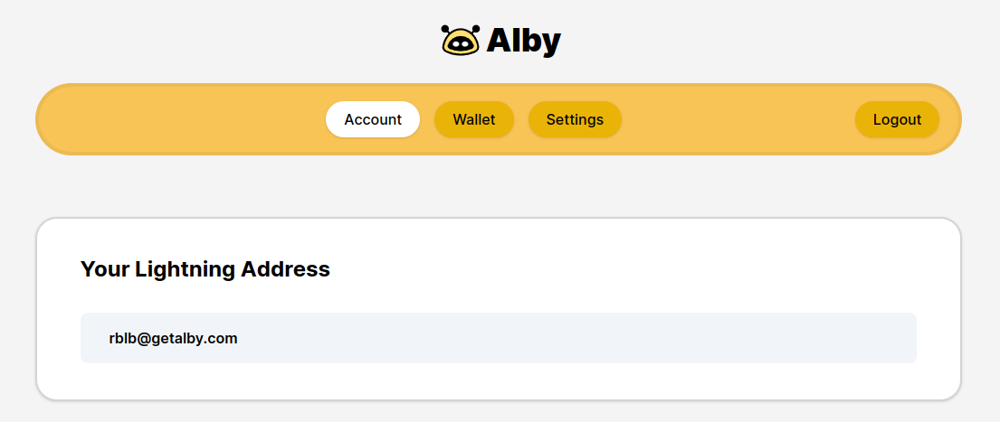
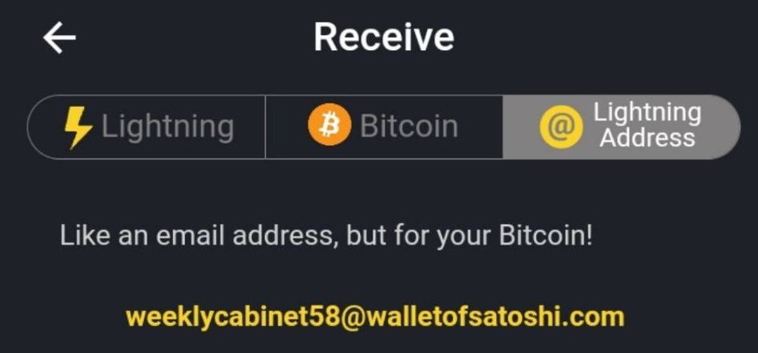
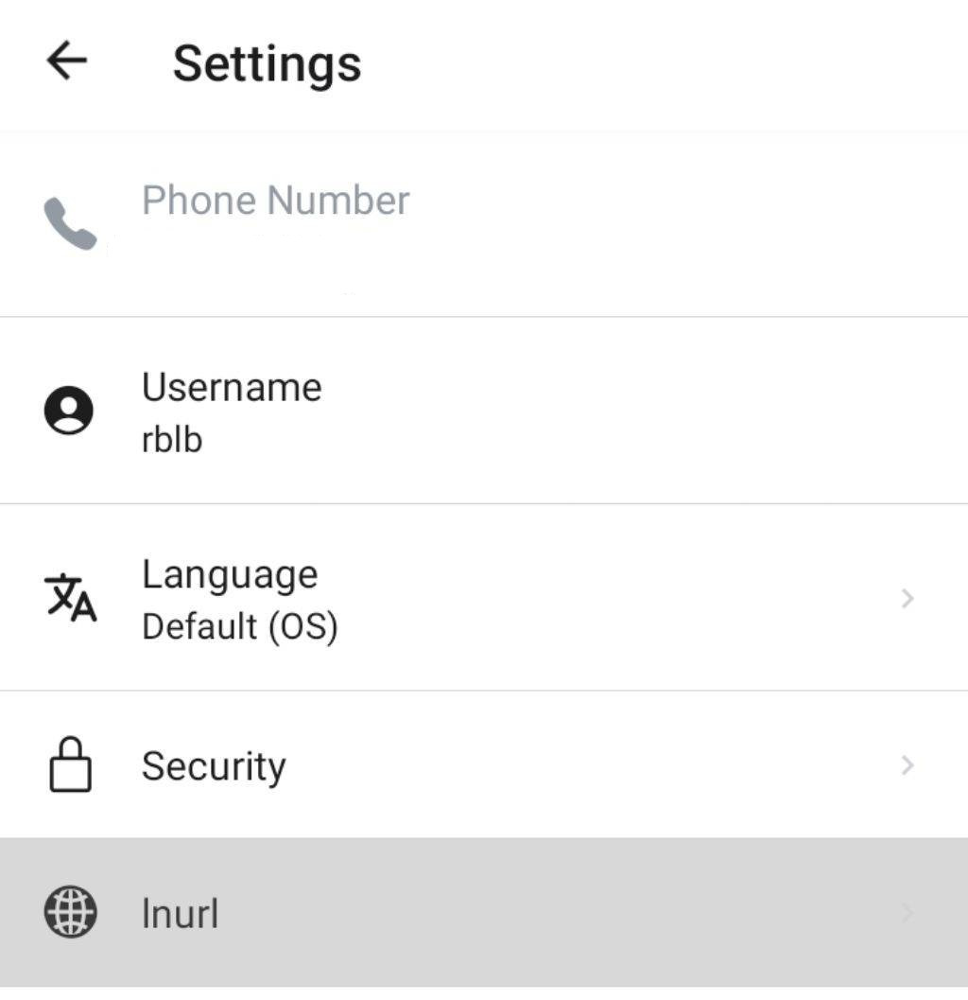
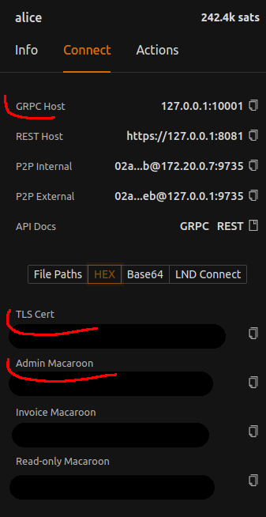
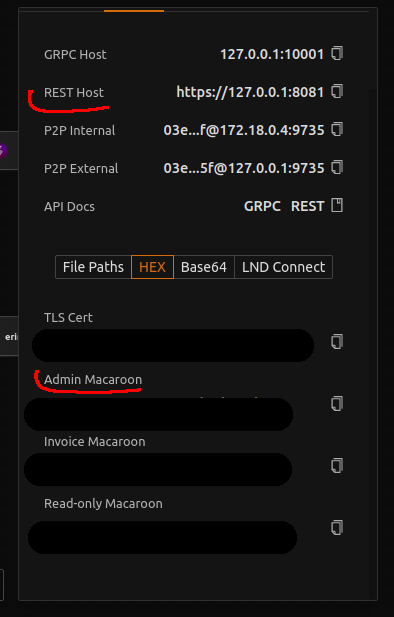
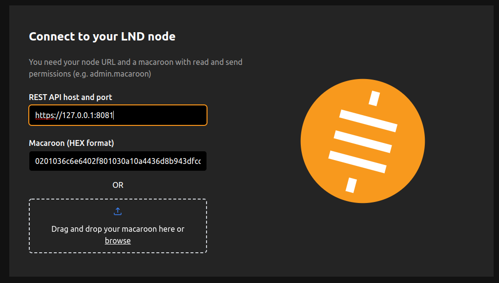

# ⚡plit Donation

<p style="text-align:center">

<h2 style="text-align:center">Value4Value for the opensource community using Bitcoin Lightning Network</h2>


</p>


We all love opensource, but often random opensource contributors don't receive tangible rewards for their efforts when contributing to established projects.

⚡plit Donation is a  low-to-zero-trust self-hosted web application that aims to change that by providing a service that opensource projects can use to automatically share their incoming donations with contributors and teams on github. 

This is possible thanks to the Bitcoin Lightning Network.


## Demo
You can see this app in action at https://donate.jmonkeyengine.org

------

## Opensource Contributor: receive rewards

As an opensource developer you can receive rewards for your contributions to projects using ⚡plit Donation by adding a lightning address or LNURL to your github profile

### Obtain a Lightning Address or LNURL
You can host one yourself or use one of the following wallets that provide also a free lightning url or address:

<details>
<summary>Alby (browser extension)</summary>

[Get Alby](https://getalby.com/)


</details>

<details>
<summary>Wallet of Satoshi (mobile wallet)</summary>

[Get Wallet of Satoshi](https://www.walletofsatoshi.com/)


</details>


<details>
<summary>Bitcoin Beach Wallet (mobile wallet)</summary>

[Get Bitcoin Beach Wallet](https://play.google.com/store/apps/details?id=com.galoyapp&hl=en&gl=US)


</details>

Or you can check a more exhaustive [list of lightning address providers, here](https://lightningaddress.com/#providers).


### Add the Lightning Address or LNURL to your GitHub Profile

Once you have obtained a lightning address or LNURL, the quickest way to add it to your github account is by placing it in your bio preceeded by a ⚡ emoji.

<details>
<summary>Show example</summary>


</details>


*Other ways: TO BE DOCUMENTED*


------

## Project Maintainer: Use ⚡plit Donation for your project

As a project maintainer you can host your instance of ⚡plit Donation following these steps.

You will need an host running [docker](https://www.docker.com/) and a remote [LNDHub](https://lndhub.io/) instance with CORS enabled ( by default we use https://ln.getalby.com , the donor can chose to use its own ).

To run an instance you need to

1. Create the host directories to hold configurations and data
```bash
mkdir -p /srv/splitdonation/config
mkdir -p /srv/splitdonation/data
chown 1000:1000 -Rf /srv/splitdonation/data
chown 1000:1000 -Rf /srv/splitdonation/config
```


2. Clone this repo
```bash 
cd /tmp
git clone https://github.com/riccardobl/SplitDonation.git
```

3. Customize the configurations
    - copy `config/config.jsonc.template` to `/srv/splitdonation/config/config.jsonc`
    - copy `config/backend.jsonc.template` to `/srv/splitdonation/config/backend.jsonc`
    - open and edit `/srv/splitdonation/config/config.jsonc` and `/srv/splitdonation/config/backend.jsonc` (the comments will tell you how)

4. Build and run with docker
```bash
./docker-start.sh
```

*This should be put behind an https reverse proxy such as nginx or caddy. For this reason, by default, there is no port exposed in production mode. If you wish to expose the http port you can add -p7069:7069 at the end of the command.*


### Targets in `config.jsonc`
In `config.jsonc` you need to specify a list of targets that can receive the donations.

Each target has the following common params

- **weight**:  the default weight of the target, higher weight mean the target will be set to receive a bigger donation than lower weights targets (the donor can tweak the weights). 
- **minSats**: *(optional)* minimum amount of sats for the donation toward this target (values below this will automatically be set to zero)
- **minWeight**: *(optional)* minimum weight of the target, weights below this value will be set to zero
- **enabled**: *(optional)* boolean that tells if the target is enabled or not (true by default)

The other params depend fom the type of the target:


- [Lightning Addresses](#lightning-addresses)
- [Github Repo Contributors](#github-repo-contributors)
- [Github Team members](#github-team-members)
- [Collectives hosted by OpenCollectives (opted in to crypto donations)](#opencollective)


### Lightning Addresses
The lightning address target is a target pointing to a given lightning address:

```jsonc
{
    "type":"lightning-address",
    // customize this part
    "addr":"lightning@address.tld",
    "description":"A description for this target",
    "weight":0.5 ,
    //"minSats": ...,
    //"minWeight": ...
    //
}
```

### Github Repo Contributors
The Github Repo target will try to find lightning addresses of the collaborators of the specified github repos:

```jsonc
{
    "type":"github-repo",
    // customize this part
    "modifier":"top-alltime", // valid modifiers: top-alltime top-monthly
    "limit":30, // top X contributors
    "autorefresh":true, // tell the backend to autorefresh this target (makes donations computation faster for big repos)
    "org":"organization or user owning these repos",
    "repos":[ // list of repos
        "repo1",
        "repo2",
        "repo3"
    ],
    "description":"A description for this target",
    "weight":0.7
    //"minSats": ...,
    //"minWeight": ...
    //
}
```
### Github Team members
The Github Team target will try to find lightning addresses of the members of the specified github teams:
```jsonc
{
    "type":"github-org-team",
    // customize this part
    "org":"organization owning these teams",
    "autorefresh":true, // tell the backend to autorefresh this target (makes donations computation faster for big teams)
    "teams":[ // list of teams
        "team1",
        "team2"
    ],
    "description":"A description for this target",
    "weight":0.5
    //"minSats": ...,
    //"minWeight": ...
    //
}
```

### OpenCollective
Since OpenCollective is already the established way for many opensource projects to receive donations, ⚡plit Donation provides a target to bridge donations to opencollectives opted in to receive crypto donations. 

Since OpenCollective doesn't support lightning at the moment,this is done through an exchange and might incur in higher fees than usual.

```jsonc
 {
    "type":"opencollective",
    // customize this part
    "collective":"slug of the collective",
    "minSats": 5034, // opencollective has a minimum donation size. You should probably leave this like that to avoid the donation being rejected.
    "description":"A description for this target",
    "weight":0.5
    //"minWeight": ...
    //
}
```

## Optional: Replace the "unspent fees" target
For each donation made through ⚡plit Donation, a conservative fee reserve is allocated to pay for routing and (when needed) exchange fees.
Donors have an option to withdraw the unspent reserve after each donation or to send it to a predefined lightning address.
By default this address is hardcoded and associated with this project as a sort of dev fee, however you are free to replace it with your own if you wish so. The address to look for is `rblb@getalby.com`.

If you still wish to donate some sats to the project you can scroll down to [Donate to this project](#donate-to-this-project).


------

## Developer: Create the development environment

To build a development environment on linux you will need [docker](https://www.docker.com/) and [polar](https://github.com/jamaljsr/polar).


### 1. Create a testnet with polar
First install docker and run the [post installation steps](https://docs.docker.com/engine/install/linux-postinstall/) to enable it for non root users (needed by polar);

Then install polar and create a network made by 1 btc node and 5 LND nodes. 


Connect them together with some channels, see screenshot below.


### 2. Start the development environment
The next step is to start the development environment, but first you'll have to configure it.

Cd into the cloned repo and rename `.env-template` to `.env`, open it with a text editor and configure each variable to match the ones provided by polar (GRPC address, CERT HEX and MACAROON HEX) for each node.



After that, you should add the following lines to your `/etc/hosts`

```
127.0.0.1 alice-lnsplitpay.test
127.0.0.1 bob-lnsplitpay.test
127.0.0.1 carol-lnsplitpay.test
127.0.0.1 dave-lnsplitpay.test
127.0.0.1 erin-lnsplitpay.test
```
This will provide the following lightning addresses that can be used for local testing:
```
pay@alice-lnsplitpay.test 
pay@bob-lnsplitpay.test
pay@carol-lnsplitpay.test
pay@dave-lnsplitpay.test
pay@erin-lnsplitpay.test
```


Once the configuration is done, you can start the environment by running
```bash
./run-dev-env.sh
```


### 3. Connect via Alby

To finish the setup we will connect a lightning wallet to one of our local node. We  will use the  [GetAlby](https://getalby.com) extension, but other wallets will work.

Go back to polaris, grab the RPC url and macaroon of the alice node:



Open the REST url and accept the self signed certificate in the browser.

Install the [GetAlby](https://getalby.com) extension and use it to connect to the LND node with the REST host and Macaroon obtained from polar




### 4. Run ⚡plit Donation in DEV MODE
 You can now start ⚡plit Donation in dev mode by running
```bash
DEV=1 CONFIG_PATH=test-config ./start.sh
```
Or with docker
```bash
DEV=1 ./docker-start.sh
```

## Donate to this project
You can support this project through 
- Bitcoin⚡: `rblb@getalby.com`
- Bitcoin: `bc1qdgugzpdvdvlme38zt7zt7jjh42htzu0txq8m9x`
- [Github Sponsor](https://github.com/sponsors/riccardobl)
